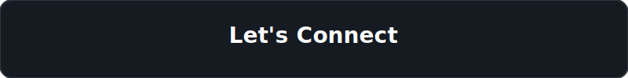

<picture>
  <source media="(prefers-color-scheme: dark)" srcset="assets/hero-banner.svg">
  <source media="(prefers-color-scheme: light)" srcset="assets/hero-banner.svg">
  
</picture>

 

<picture>
  <source media="(prefers-color-scheme: dark)" srcset="assets/divider.svg">
  <source media="(prefers-color-scheme: light)" srcset="assets/divider.svg">
  
</picture>

 

## 💫 About Me

<table>
  <tr>
    <td width="40%" align="center">
      
    </td>
    <td width="60%">
      <h3>👨‍💻 Who Am I?</h3>
      <ul>
        <li>🚀 <b>6+ Years Experience</b> in Building Scalable Systems</li>
        <li>💙 <b>Full Stack Developer</b> specialized in <b>React</b> & <b>Node.js</b></li>
        <li>📱 Mobile Development with <b>React Native</b></li>
        <li>🌱 Currently learning and building with <b>Go</b></li>
        <li>☁️ Extensive experience with <b>AWS</b>, <b>Docker</b>, and <b>Kubernetes</b></li>
        <li>🤖 Exploring the world of <b>AI Applications</b></li>
        <li>🐧 Passionate about <b>Linux</b> & <b>Open Source</b></li>
      </ul>
    </td>
  </tr>
</table>

 

  

 

  

 

<table>
  <tr>
    <td width="33%" align="center">
       
      <h3>Frontend</h3>
      
React Next.js Redux TypeScript Tailwind CSS

    </td>
    <td width="33%" align="center">
       
      <h3>Backend</h3>
      
Node.js Express NestJS Go

    </td>
    <td width="33%" align="center">
       
      <h3>Database & Cloud</h3>
      
MongoDB PostgreSQL Docker Kubernetes AWS

    </td>
  </tr>
</table>

 

  

 

  

 

<table>
  <tr>
    <td width="50%">
      <h3>💻 Code-O-Bit</h3>
      
<i>Competitive Programming Platform</i>

      <ul>
        <li>Online Judge & Live Leaderboard</li>
        <li>Contest Platform & Code Editor</li>
      </ul>
      
<b>Tech:</b> React, Node.js, Docker

    </td>
    <td width="50%">
      <h3>🤖 AI Job Apply</h3>
      
<i>AI Powered Job Automation</i>

      <ul>
        <li>Resume Matching & AI Assistant</li>
        <li>Auto Apply & Analytics Dashboard</li>
      </ul>
      
<b>Tech:</b> Next.js, Python, OpenAI

    </td>
  </tr>
  <tr>
    <td width="50%">
      <h3>📱 React Native Apps</h3>
      
<i>Cross Platform Mobile Apps</i>

      <ul>
        <li>Android & iOS Development</li>
        <li>Expo & OTA Updates</li>
      </ul>
      
<b>Tech:</b> React Native, Expo, Redux

    </td>
    <td width="50%">
      <h3>🏫 School ERP</h3>
      
<i>Enterprise School System</i>

      <ul>
        <li>Attendance, Fees & Timetable</li>
        <li>Reports & Notifications</li>
      </ul>
      
<b>Tech:</b> NestJS, PostgreSQL, React

    </td>
  </tr>
</table>

 

  

 

## 📚 Timeline & Roadmap

<table>
  <tr>
    <td width="20%" align="center"><b>Current Focus</b></td>
    <td>Mastering <b>Go</b> for backend development</td>
  </tr>
  <tr>
    <td width="20%" align="center"><b>Next</b></td>
    <td>Building robust <b>Microservices</b></td>
  </tr>
  <tr>
    <td width="20%" align="center"><b>Next</b></td>
    <td>Advanced <b>System Design</b> patterns</td>
  </tr>
  <tr>
    <td width="20%" align="center"><b>Next</b></td>
    <td>Deep dive into <b>Kubernetes</b></td>
  </tr>
  <tr>
    <td width="20%" align="center"><b>Next</b></td>
    <td><b>Cloud Native</b> architectures</td>
  </tr>
</table>

 

  

 

## 📈 Skills Progress

<table>
  <tr>
    <td width="50%"><b>Frontend (React, TS)</b></td>
    <td width="50%">████████████████████ <b>95%</b></td>
  </tr>
  <tr>
    <td width="50%"><b>Mobile (React Native)</b></td>
    <td width="50%">████████████████████ <b>95%</b></td>
  </tr>
  <tr>
    <td width="50%"><b>Backend (Node.js)</b></td>
    <td width="50%">███████████████████░ <b>90%</b></td>
  </tr>
  <tr>
    <td width="50%"><b>Cloud (Docker, AWS)</b></td>
    <td width="50%">██████████████░░░░░░ <b>70%</b></td>
  </tr>
  <tr>
    <td width="50%"><b>Backend (Go)</b></td>
    <td width="50%">█████████████░░░░░░░ <b>65%</b></td>
  </tr>
</table>

 

  

 

  
  
    
  
  <a href="https://github.com/pranay213">GitHub</a> &nbsp; | &nbsp;
  <a href="https://linkedin.com">LinkedIn</a> &nbsp; | &nbsp;
  <a href="mailto:contact@example.com">Email</a> &nbsp; | &nbsp;
  <a href="#">Portfolio</a>

 

  

