  <picture>
    <source media="(prefers-color-scheme: dark)" srcset="assets/intro.svg">
    <source media="(prefers-color-scheme: light)" srcset="assets/intro.svg">
    
  </picture>
   
  <picture>
    <source media="(prefers-color-scheme: dark)" srcset="assets/stats.svg">
    <source media="(prefers-color-scheme: light)" srcset="assets/stats.svg">
    
  </picture>
   
  <picture>
    <source media="(prefers-color-scheme: dark)" srcset="assets/charts.svg">
    <source media="(prefers-color-scheme: light)" srcset="assets/charts.svg">
    
  </picture>
   
  <picture>
    <source media="(prefers-color-scheme: dark)" srcset="assets/repos.svg">
    <source media="(prefers-color-scheme: light)" srcset="assets/repos.svg">
    
  </picture>

