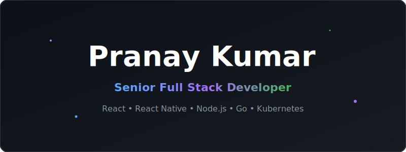
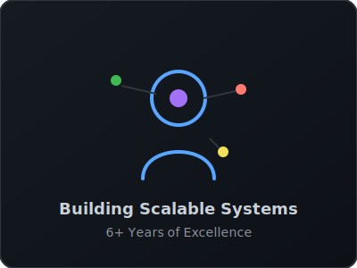
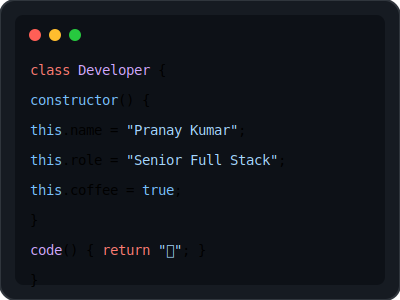

<picture>
  <source media="(prefers-color-scheme: dark)" srcset="assets/hero-banner.svg">
  <source media="(prefers-color-scheme: light)" srcset="assets/hero-banner.svg">
  
</picture>

  

<picture>
  <source media="(prefers-color-scheme: dark)" srcset="assets/divider.svg">
  <source media="(prefers-color-scheme: light)" srcset="assets/divider.svg">
  
</picture>

  

## 💫 About Me & Architecture

  

 

<table>
  <tr>
    <td width="50%" valign="top">
      <h3>👨‍💻 Who Am I?</h3>
      
I am a <b>Senior Full Stack Developer</b> with over 6 years of experience building scalable, high-performance systems. I specialize in designing robust architectures that can handle millions of users.

      <ul>
        <li>🚀 <b>Backend:</b> Node.js, Go, NestJS</li>
        <li>💙 <b>Frontend:</b> React, Next.js, Tailwind</li>
        <li>📱 <b>Mobile:</b> React Native, Expo</li>
      </ul>
    </td>
    <td width="50%" valign="top">
      <h3>☁️ Cloud & DevOps</h3>
      
My passion lies not just in writing code, but in deploying and scaling it efficiently across modern cloud infrastructure.

      <ul>
        <li>☁️ <b>Cloud Providers:</b> AWS, GCP</li>
        <li>🐳 <b>Containerization:</b> Docker, Kubernetes</li>
        <li>🐧 <b>OS & CI/CD:</b> Linux, GitHub Actions</li>
      </ul>
    </td>
  </tr>
</table>

  

  

  

  

 

  

  

  

  

  

 

<table>
  <tr>
    <td width="50%" valign="top">
      <h3>💻 Code-O-Bit</h3>
      
<i>High-Performance Competitive Programming Platform</i>

      
Built a highly scalable online judge capable of compiling and running untrusted code securely using Docker containers and Kubernetes.

      
<b>Tech:</b> React, Node.js, Go, Docker, Redis

    </td>
    <td width="50%" valign="top">
      <h3>🤖 AI Job Apply</h3>
      
<i>LLM-Powered Job Automation</i>

      
An intelligent agent that matches resumes against job descriptions and automatically fills out application forms using OpenAI APIs.

      
<b>Tech:</b> Next.js, Python, OpenAI, PostgreSQL

    </td>
  </tr>
  <tr>
    <td width="50%" valign="top">
      <h3>📱 React Native Ecosystems</h3>
      
<i>Cross Platform Mobile Applications</i>

      
Developed multiple production-grade mobile applications with seamless OTA updates, offline-first architectures, and fluid animations.

      
<b>Tech:</b> React Native, Expo, Redux Toolkit, SQLite

    </td>
    <td width="50%" valign="top">
      <h3>🏫 Enterprise ERP Systems</h3>
      
<i>Scalable B2B Platforms</i>

      
Designed a multi-tenant SaaS architecture for educational institutions, handling thousands of concurrent users during peak hours.

      
<b>Tech:</b> NestJS, PostgreSQL, AWS, React

    </td>
  </tr>
</table>

  

  

  

## 📚 Technical Roadmap

<table>
  <tr>
    <td width="20%" align="center"><b>Current Focus</b></td>
    <td>Mastering <b>Go</b> concurrency patterns for high-throughput backend services.</td>
  </tr>
  <tr>
    <td width="20%" align="center"><b>Q3 2026</b></td>
    <td>Transitioning monolithic applications to <b>Event-Driven Microservices</b>.</td>
  </tr>
  <tr>
    <td width="20%" align="center"><b>Q4 2026</b></td>
    <td>Advanced <b>System Design</b> & Distributed Database architectures.</td>
  </tr>
</table>

  

  

