

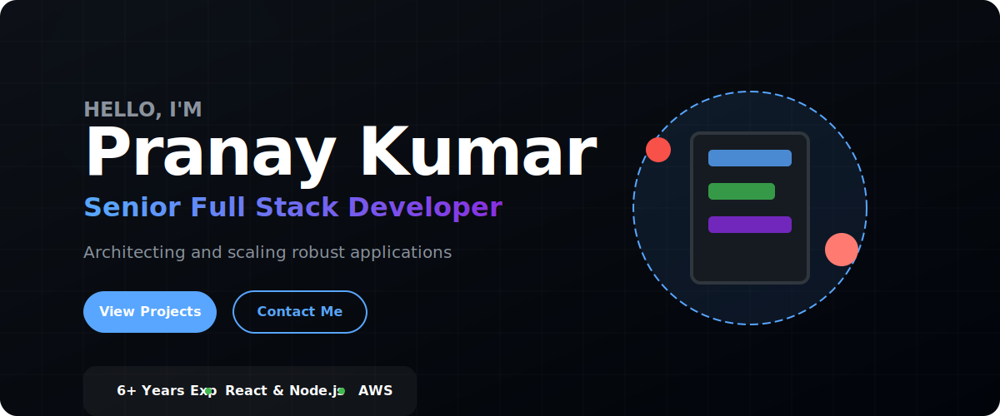

  

<table width="100%" style="border-collapse: collapse; border: none;">
  <!-- GitHub Analytics -->
  <tr>
    <td width="50%" align="center" style="border: none; padding: 10px;"></td>
    <td width="50%" align="center" style="border: none; padding: 10px;">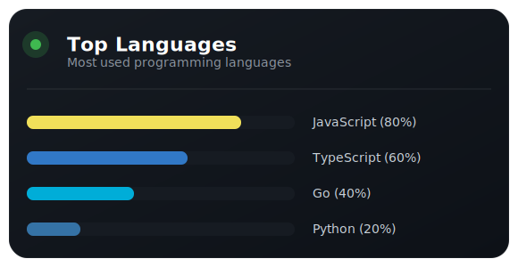</td>
  </tr>
  
  <!-- About Me -->
  <tr>
    <td width="50%" align="center" style="border: none; padding: 10px;"></td>
    <td width="50%" align="center" style="border: none; padding: 10px;">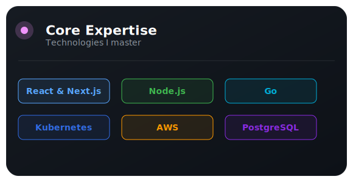</td>
  </tr>
  
  <!-- Featured Projects -->
  <tr>
    <td width="50%" align="center" style="border: none; padding: 10px;">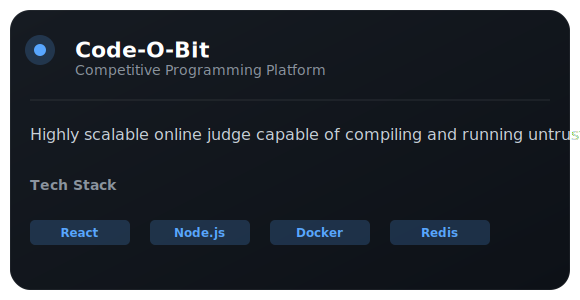</td>
    <td width="50%" align="center" style="border: none; padding: 10px;">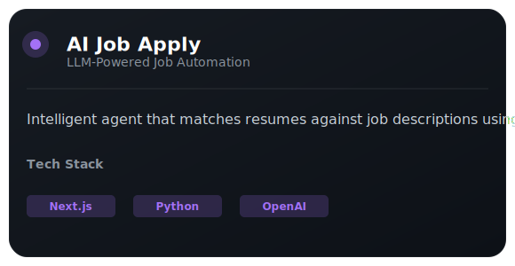</td>
  </tr>
  <tr>
    <td width="50%" align="center" style="border: none; padding: 10px;">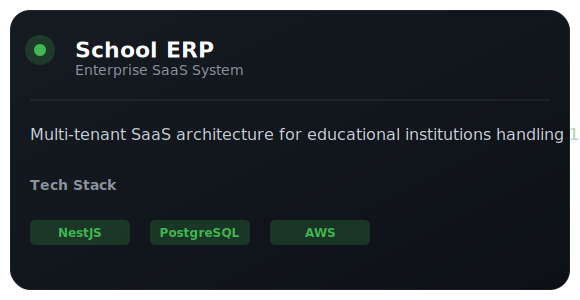</td>
    <td width="50%" align="center" style="border: none; padding: 10px;">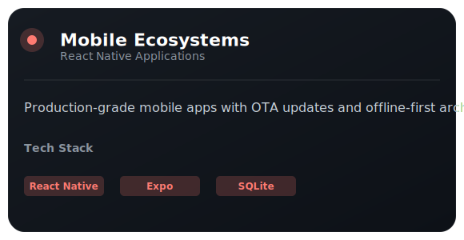</td>
  </tr>

  <!-- Architecture Skills -->
  <tr>
    <td width="50%" align="center" style="border: none; padding: 10px;">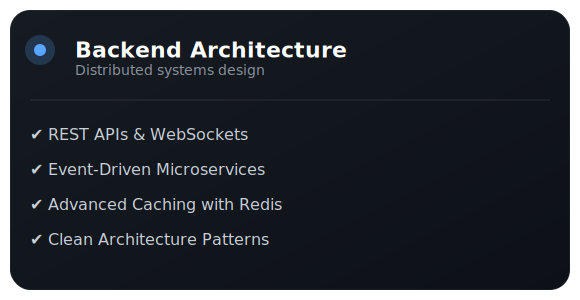</td>
    <td width="50%" align="center" style="border: none; padding: 10px;">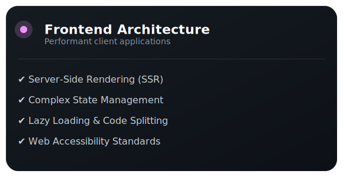</td>
  </tr>
  
  <!-- Professional Skills -->
  <tr>
    <td width="50%" align="center" style="border: none; padding: 10px;">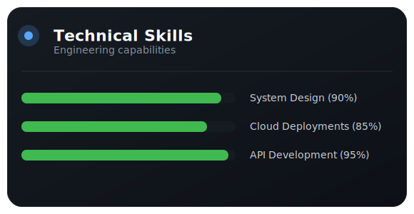</td>
    <td width="50%" align="center" style="border: none; padding: 10px;">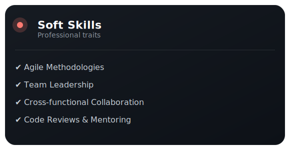</td>
  </tr>

  <!-- Current Focus -->
  <tr>
    <td width="50%" align="center" style="border: none; padding: 10px;">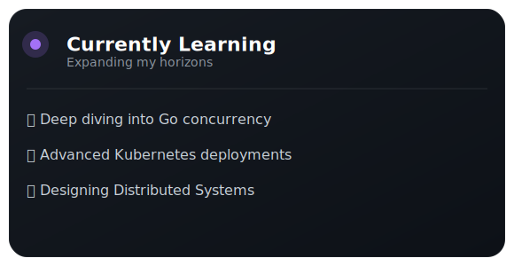</td>
    <td width="50%" align="center" style="border: none; padding: 10px;">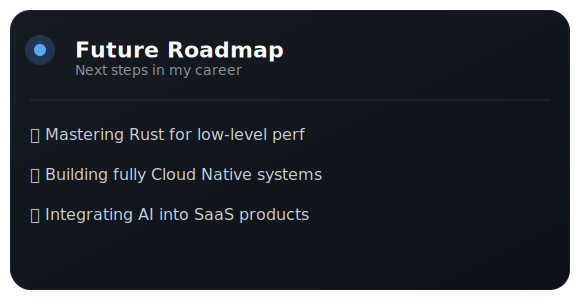</td>
  </tr>

  <!-- Open Source -->
  <tr>
    <td width="50%" align="center" style="border: none; padding: 10px;">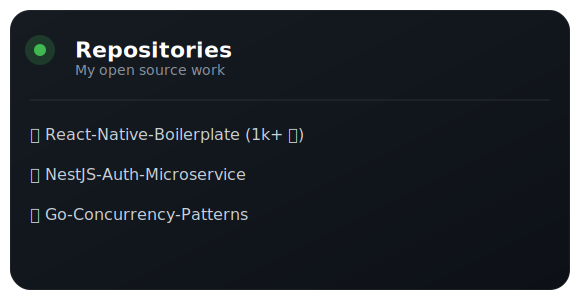</td>
    <td width="50%" align="center" style="border: none; padding: 10px;">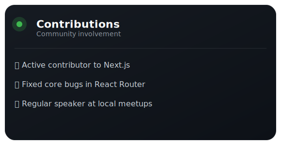</td>
  </tr>

  <!-- Coding Profiles -->
  <tr>
    <td width="50%" align="center" style="border: none; padding: 10px;">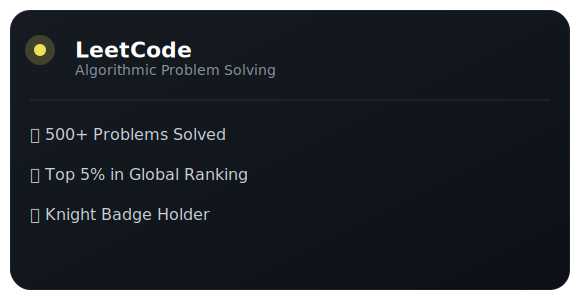</td>
    <td width="50%" align="center" style="border: none; padding: 10px;">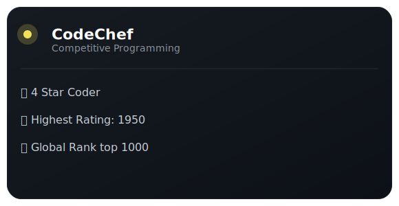</td>
  </tr>

  <!-- Experience -->
  <tr>
    <td width="50%" align="center" style="border: none; padding: 10px;">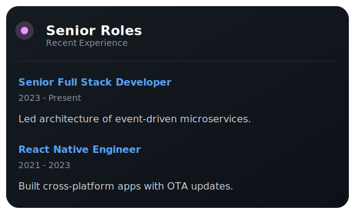</td>
    <td width="50%" align="center" style="border: none; padding: 10px;">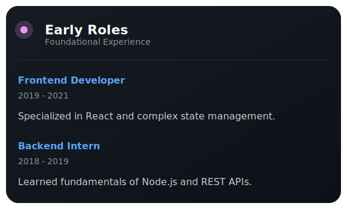</td>
  </tr>

  <!-- Certifications -->
  <tr>
    <td width="50%" align="center" style="border: none; padding: 10px;"></td>
    <td width="50%" align="center" style="border: none; padding: 10px;">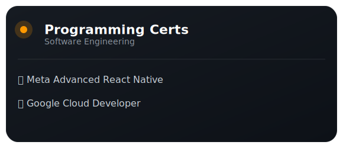</td>
  </tr>

  <!-- Contact -->
  <tr>
    <td width="50%" align="center" style="border: none; padding: 10px;">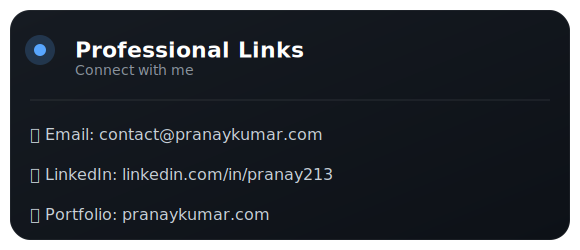</td>
    <td width="50%" align="center" style="border: none; padding: 10px;"></td>
  </tr>

</table>

  

